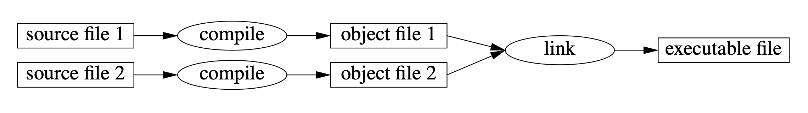
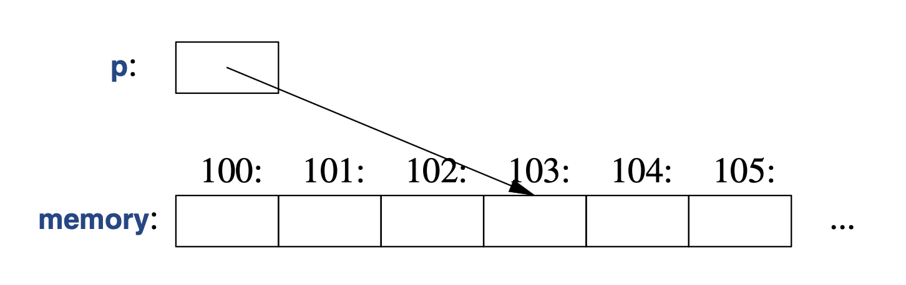

# Chapter 1

## Advices

- You don’t have to know every detail of C++ to write good programs.
- Focus on programming techniques, not on language features.
- State intent in comments, not in code.

## Key ideas

1. **Types define both meaning and memory layout.** Every object and expression has a type, and the type determines
   what operations are valid and how the value is represented in memory.

2. **Objects, values, and variables are different concepts.** An object is memory holding a value of some type;
  a value is bits interpreted according to a type; a variable is a named object.

3. **Modern C++ prefers immediate and explicit initialization.** Uninitialized objects are dangerous, and `{}`
  initialization helps prevent narrowing conversions.

4. **Value semantics are the default.** Assigning one object to another usually creates an independent value;
  sharing or aliasing requires references or pointers.

5. **Lifetime matters.** Every object must be constructed before use and destroyed after its lifetime ends.
  Many C++ bugs come from using objects outside their valid lifetime.

6. **References express required access; pointers express optional or low-level access.**
  Prefer references when null is not valid, and use `nullptr` for null pointers in modern C++.

7. **`const`, `constexpr`, and `consteval` express different levels of immutability and compile-time evaluation.**
  `const` protects against modification; `constexpr` allows compile-time evaluation; `consteval` requires it.

8. **Avoid relying on evaluation order when side effects are involved.** Complex expressions with mutations can
  lead to undefined or surprising behavior, so split them into clear steps.

9. **C++ is close to hardware but supports high-level abstractions.** Good modern C++ uses abstractions like `std::vector`, `std::string`, references, RAII, and the standard library while still allowing low-level control when needed.

## Programs

- The compiler produces object files, which are then linked together to create an executable:
  
- An executable program is created for a specific hardware/system combination.
  Only the source code is portable across different systems.
- The C++ standard library is largely implemented in C++ itself.
- The type of an object determines the set of operations applicable to it and its layout in memory.
- Every C++ program must have one global function named `main` that serves as the entry point of the program.
- If `main` doesn't return any value, the system assumes it returns `0`, which indicates successful execution.
- Not every OS, such as Windows, requires `main` to return an `int`, but it's a common convention in C++.
- The `std::` prefix indicates that some name is defined in the `std` namespace, which is where the C++ standard
  library's names are defined.
- The `import` directive is new in C++20 and presenting all of the standard library as modules is a work in progress.
  For now, we still use `#include` to include header files.

## Functions

- Functions provide the basic vocabulary of computation, just as types provide the basic vocabulary of data.
- If we can't find a suitable name for a function, it's a sign that we have a design problem.
- In a function declaration, the return type comes before the function name and the parameter list is enclosed in parentheses.
- Implicit argument conversions are allowed in C++. For example, if a function expects an `int` and you pass a `double`,
  the `double` will be converted to an `int` before the function is called.
- A function declaration may contain argument names, but the compiler ignores them unless the declaration also
  provides a function body.
- The type of the function consists of the return type and the types of its parameters:

  ```cpp
  double get(const std::vector<double> &vec, int index); // type: double(const vector<double>&, int)
  ```

- When function is a member of a class, its type also includes the class name:

    ```cpp
    char& String::operator[](int index); // type: char& String::(int)
    ```

- If two functions are defined with the same name but different parameter types, the compiler will choose the most
  appropriate one based on the types of the arguments provided in the function call. This is known as function overloading.

## Types, Variables, and Arithmetic

- Every name and every expression has a type, which determines the set of operations that can be performed on it and its layout in memory.
- A type defines a set of possible values and a set of operations (for an object).
- An object is some memory that holds a value of some type.
- A value is a set of bits interpreted according to a type.
- A variable is a named object.
- A `char` is typically a single byte that can hold a character, but it can also be used to hold small integers.
- The sizes of other types are multiples of the size of a `char`.
- The size of types can vary between different systems and compilers, but there are some common sizes:
  - `char`: 1 byte
  - `short`: 2 bytes
  - `int`: 4 bytes
  - `long`: 4 or 8 bytes (depending on the system)
  - `long long`: 8 bytes
  - `float`: 4 bytes
  - `double`: 8 bytes
- The size of a pointer is typically 4 or 8 bytes, depending on the system (32-bit or 64-bit).
- When we want a size of a specific size, we use a standard-library alias, such as `std::int32_t` for a 32-bit integer.
- The size of a type can be determined using the `sizeof` operator.
- Integer literals are by default decimal, but they can also be written in binary (e.g., `0b1010`), octal (e.g., `012`),
  or hexadecimal (e.g., `0xA`) form.
- Floating-point literals can be written in a decimal form (e.g., `3.14`) or in an exponential form (e.g., `1.5e-2`).
- To make long literals more readable, we can use the single-quote character as a digit separator (e.g., `1'000'000`).
- Unary operator `+` can be used to promote a `char` to an `int`.
- `&&` and `||` are short-circuiting logical AND and OR operators, while `&` and `|` are bitwise AND and OR operators.
- One of the common use case of bitwise operators is to manipulate flags, which are often represented as bits in an integer.

  ```cpp
  const int Read  = 1; // 0001
  const int Write = 2; // 0010
  const int Exec  = 4; // 0100

  int permissions = Read | Write; // 0011

  if (permissions & Read) {
      std::cout << "Can read\n";
  }
  ```

- The usual arithmetic conversions aim to ensure that expressions are computed at the highest precision of their operands.
- For historical reasons related to optimization, the order of evaluation of other expressions (e.g. `f(x) + g(y)`)
  and of function arguments (e.g. `f(g(x), h(y))`) is unspecified, which means that the compiler can choose any order
  to evaluate the operands. This can lead to undefined behavior if the operands have side effects, so it's important
  to avoid such expressions ‼️

## Initialization

- `double d2 {2.3};` initializes `d2` with the value `2.3` using list initialization, which is
  a uniform initialization syntax introduced in C++11. `=` is optional in this case.
- Complex number initialization can be done using the `std::complex` class template from the `<complex>` header:

  ```cpp
  std::complex<double> c1 = 1;       // initializes c1 to 1.0 + 0.0i
  std::complex<double> c2(1.0, 2.0); // initializes c1 to 1.0 + 2.0i
  std::complex<double> c3{3.0, 4.0}; // initializes c2 to 3.0 + 4.0i
  ```

- Vector of ints:

  ```cpp
  std::vector<int> v1 = {1, 2, 3}; // initializes v1 with the values 1, 2, and 3
  std::vector<int> v2{4, 5, 6};    // initializes v2 with the values 4, 5, and 6
  ```

- The `=` form is traditional and dates back to C and is made available in C++ for backward compatibility.
- The `{}` form is more modern and was introduced in C++11. It has some advantages, such as preventing narrowing
  conversions and allowing for uniform initialization syntax across different types:

  ```cpp
  int x1 = 3.14; // x1 will be initialized to 3 (narrowing conversion)
  int x2{3.14};  // error: narrowing conversion
  ```

- A constant cannot be left unitialized.
- A variable should only be left unitialized in extremely rare cases.
- When defining a variable, the compiler can infer its type from the initializer if we use the `auto` keyword:

  ```cpp
  auto b = true;    // b is inferred to be of type bool
  auto ch = 'x';    // ch is inferred to be of type char
  auto i = 42;      // i is inferred to be of type int
  auto d = 3.14;    // d is inferred to be of type double
  auto z = sqrt(y); // z has the type of whatever type `sqrt(y)` returns (e.g., double)
  auto bb {true};   // bb is inferred to be of type bool
  ```

- With `auto`, use `=` because there is no potential for narrowing conversion.
  But if you prefer to use `{}` constistently, that's also fine.
- Specific reasons to avoid using `auto` include:
  - The definition is in a large scope and the type is not obvious from the initializer.
  - The type is important for understanding the code and using `auto` would obscure it.
  - We want to be explicit about a variable's range of precision (e.g., using `std::int32_t` instead of `int`).

## Scope and Lifetime

- Function arguments are considered local names.
- A name is called member name (or a class member name) if it is declared inside a class, but outside any function,
  lambda expression, or enum class.
- A name is called namespace member name if it is declared in a namespace outside of any function,
  lambda expression, class definition, or enum class.
- A name not declared in any of the above categories is called a global name (global namespace member name).
- To create a member without a name, we can use the `new` operator to allocate an object on the heap and return a pointer to it:

  ```cpp
  std::string* p = new std::string("Hello, world!");
  auto p = new Record{"Hume"}; // using auto to infer the type of p
  ```

- An object must be constructed (initialized) before it can be used, and will be destroyed at the end of its scope.
- The lifetime of an object is the time between its construction and its destruction.
- For a member of a class, the lifetime of the member is the same as the lifetime of the object of which it is a member.

## Constants

- `const` is used to specify interfaces so that data can be passed to functions using pointers and references
  without allowing the function to modify the data.
- `constexpr` is evaluated at compile time and used to specify constants to allow placement of data in read-only memory,
  which can improve performance.
- For a function to be usable in a constant expression, it must be defined `constexpr` or `consteval`:

  ```cpp
  constexpr double square(double x) {
      return x * x;
  }

  auto x = 17; // x is a variable of type int

  constexpr double max1 = 1.4*square(17); // OK: 1.4*square(17) is a constant expression
  constexpr double max2 = 1.4*square(x);  // error: x is not a constant expression
  const double max3 = 1.4*square(x);      // OK: max3 is a constant, but its value is not a constant expression
  ```

- When we want a function to be used only for evaluation at compile time, we can declare it `consteval`:

  ```cpp
  consteval double square2(double x) {
      return x * x;
  }

  auto x = 17; // x is a variable of type int

  constexpr double max1 = 1.4*square2(17); // OK: 1.4*square2(17) is a constant expression
  const double max3 = 1.4*square2(x);  // error: x is not a constant
  ```

- Functions declared `constexpr` and `consteval` are C++'s version of notion of pure functions, which are functions
  that have no side effects and always produce the same output for the same input.

## Pointers, Arrays, and References

- An array is a contiguous sequence of data of the same type. This basically what hardware provides.
- Example: `char v[6]` array of 6 characters.
- Pointer can be declared like this `char* p`.

  ```cpp
  char* p = &v[3]; // p points to v's fourth element
  char x = *p; // x is the character pointed to by p (i.e., v[3])
  ```

- C++ offers a range-for-statement for iterating over arrays and other ranges:

  ```cpp
  int v[] = {1, 2, 3, 4, 5};

  for (auto x : v) {
      std::cout << x << ' '; // place a copy of each element of v in x and print it
  }
  ```

- If we don't want to make a copy of each element, we can use a reference:

  ```cpp
  for (auto& x : v) {
      ++x; // place a reference to each element of v in x and increment it
  }
  ```

- The unary `&` means "address of", and the unary `*` means "the object pointed to by".
- A reference is similar to a pointer, except that you don't need to use `*` to dereference it and
  you can't have a null reference.
- A reference cannot be made to refer to a different object after it has been initialized.
- References are particularly useful for specifying function arguments:

  ```cpp
  void sort(std::vector<int>& v); // sort takes a reference to a vector of ints and don't make a copy of it
  ```

- When we don't want to modify the argument, but still want to avoid making a copy:

  ```cpp
  void print(const std::vector<int>& v); // print takes a reference to a vector of ints and don't modify it
  ```

- Declarator operators (the ones used in declarations) include:
  - `T a[n]` declares an array of `n` elements of type `T`.
  - `T* p` declares a pointer to an object of type `T`.
  - `T& r` declares a reference to an object of type `T`.
  - `T f(a)` declares a function that takes an argument of type `a` and returns an object of type `T`.

## Null Pointers

- A null pointer is a pointer that doesn't point to any object.
- The null pointer is represented by the literal `nullptr` in C++11 and later.
- There is only one null pointer value, and it can be converted to any pointer type:

  ```cpp
  int* p1 = nullptr;  // p1 is a null pointer to an int
  char* p2 = nullptr; // p2 is a null pointer to a char
  ```

- It is wise to check if a pointer is null before dereferencing it to avoid undefined behavior:

  ```cpp
  if (p1 == nullptr) {
      return; // handle the null pointer case
  }
  // Now it's safe to dereference p1
  int value = *p1; // dereference p1 to get the value it points
  ```

- The older code might use `NULL` or `0` to represent null pointers, but `nullptr` is the preferred way in modern C++.
  It eliminates ambiguity and provides better type safety compared to `NULL` or `0`.

## Mapping to Hardware

- C++ allows us to write low-level code that can interact directly with hardware, such as manipulating memory addresses,
  performing bitwise operations, and using pointers to access specific memory locations.
- Some of the fundamental operations are implemented as a single machine instruction, such as addition, subtraction,
  bitwise operations, and pointer arithmetic.
- A machine's memory is sees as a sequence of bytes, and each byte has a unique address.
  Pointers in C++ allow us to work with these addresses directly.
  
- Unlike Java, C#, and other languages, assigning a value to a variable in C++ does not affect any other variable,
  even if they have the same value. This is because C++ uses value semantics, where each variable holds its own copy of the data.

  ```cpp
  int a = 5; // a is initialized to 5
  int b = a; // b is initialized to a's value (5), but a and b are independent variables
  a = 10;    // changing a does not affect b
  std::cout << "a: " << a << ", b: " << b <<
                std::endl; // Output: a: 10, b: 5
  ```

- If we want two different variables to refer to the same data, we can use pointers or references.

  ```cpp
  int x = 2;
  int y = 3;
  int* p = &x; // p points to x
  int* q = &y; // q points to y
  p = q;       // now p points to y, so both p and q refer to the same data (y)
  *p = 10;
  std::cout << "x: " << x << ", y: " << y <<
                std::endl; // Output: x: 2, y: 10
  ```

- For almost all types, the effect of reading from or writing to an uninitilized variable is undefined ‼️

## Things I didn't know before

- C-style strings are null-terminated arrays of characters, which means that the last character is
  a null character (`'\0'`) that indicates the end of the string. To iterate over a C-style string,
  we can use a pointer to the first character and increment it until we reach the null character:

  ```cpp
  const char* s = "Hello, world!";
  while (*s != '\0') {
      std::cout << *s; // print the character pointed to by s
      ++s; // move the pointer to the next character
  }
  ```

- In C++, an if-statement can define a variable that is local to the if-block:

  ```cpp
  if (auto n = v.size(); n > 0) {
      std::cout << "The vector has " << n << " elements.\n";
      --n; // n is still accessible here
  }
  ```
